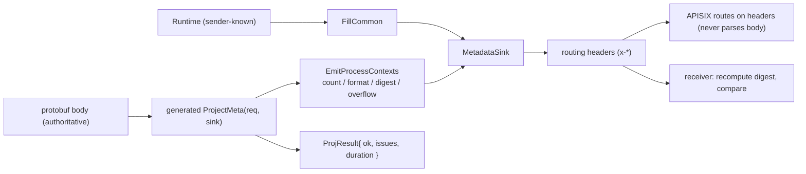
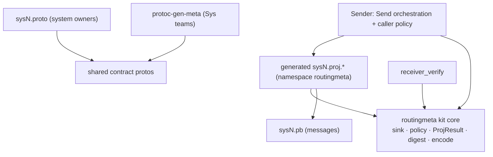

# Architecture Spine — grpc-routing-meta

A **shared library** authored by the Sys1/2/3 teams and **distributed to the Sender team**.
Its one job: project routing metadata out of the authoritative protobuf body so a gateway can
route on headers that cannot drift from the body. This spine fixes only the invariants the five
productionization epics must share; the code owns the rest.

## Fidelity & Declared Deviations

This is a **methodology A/B run scored on fidelity to the locked `refs/plan.md`.** plan.md
decisions are locked: any AD that deviates MUST name the specific plan.md decision it
overrides and carry a **PENDING-RATIFICATION** status — no silent deviation. Read-only
guardrails (CR3 `refs/` read-only; no push to any remote) are recorded in Conventions.

**One declared deviation stands:** **AD-4** keeps `Send` orchestration out of the kit,
which overrides **plan.md P0.3 ("promote `Send` into kit")** and the plan.md pivot API.
This was an explicit product/architecture choice (the lib reports, the consumer
orchestrates); it is marked PENDING-RATIFICATION and carries a downstream PM action:
relax PRD **FR6 / G-E** ("`Send` defined in the kit") via `bmad-edit-prd` before stories
are built. The read-only BRIEF criterion E is location-agnostic and is unaffected.

## Design Paradigm

**Codegen-driven projection pipeline, body-authoritative.** A `protoc` plugin
(`protoc-gen-meta`) generates `ProjectMeta(req, sink)`, which projects the protobuf body into
routing headers; a `MetadataSink` abstracts the transport (test `VectorSink` / production
`GrpcSink`); one shared policy header centralizes the limits. The lib **populates + reports**;
the consumer **orchestrates + decides** (SPEC §7, "report, don't dictate").



Namespace / ownership map:

| Layer | Lives in | Owner |
| --- | --- | --- |
| shared contract protos (`process_context`, `metadata_options`) | `proto/` | Sys teams (shared) |
| per-system protos (annotations only) | `proto/sysN.proto`, package `sysN.v1` | each system owner |
| plugin + generated projection | `src/plugin/`, generated `*.proj.*` → `namespace routingmeta` | Sys teams (shared lib) |
| kit core (sink, policy, ProjResult, digest, encode) | `src/common/` → `namespace routingmeta` | Sys teams (shared lib) |
| `Send` orchestration + caller policy | Sender app (demo: `sender/`) | **Sender team** |

## Invariants & Rules

Dependency direction (an arrow means *depends on*; the kit core depends on **nothing**
system-specific — no arrow ever points from `kit-core` outward):



### AD-1 — Body-authoritative projection via codegen `[ADOPTED]`
- **Binds:** all body-derived headers
- **Prevents:** headers drifting from the body; hand-written per-system header extraction
- **Rule:** every body-derived header MUST be emitted by the generated `ProjectMeta`; no header value exists without a body source. An empty body field projects as `Key=` (present-but-empty), not an omission.

### AD-2 — One coherent lib namespace
- **Binds:** plugin output + all kit hand-written surface
- **Prevents:** a distributed lib's surface scattering across per-system namespaces it doesn't own
- **Rule:** generated `ProjectMeta` and every kit symbol (`Send` is **not** one — see AD-4) MUST be declared in `namespace routingmeta`. Generated `*.proj.h` wraps its output in `routingmeta` and `#include`s the kit headers. **Currently global (must all move):** the generated `ProjectMeta` *and* `struct Runtime` + `FillCommon` in `common_headers.h` are presently at file scope; moving them together is consistent and lets the demo `Send`'s unqualified `FillCommon(rt, sink)` resolve by the same ADL-on-sink mechanism as `ProjectMeta` (AD-3).

### AD-3 — `ProjectMeta` resolved by ADL on the sink argument
- **Binds:** the sender path; consumer-written `Send`
- **Prevents:** `Send` needing per-type includes/qualification; ADL being defeated by a proto's package declaration
- **Rule:** a caller's `Send` calls **unqualified** `ProjectMeta(req, sink)`; resolution is ADL on the `routingmeta::MetadataSink` argument, which is **always** a `routingmeta` type. (Resolution MUST NOT depend on the request's package namespace.)

### AD-4 — Lib contract = populate + report; orchestration is the Sender's `[DECIDED — DEVIATES FROM plan.md P0.3; PENDING CROSS-TEAM RATIFICATION]`
- **Binds:** the public API; E1; FR1/FR6
- **Prevents:** the lib over-reaching into send orchestration; consumers diverging on projection
- **Rule:** the lib guarantees ONLY (a) correct metadata population (`FillCommon` + generated `ProjectMeta`) and (b) structured reporting (`ProjResult`). The kit ships **no `Send` symbol**; `Send` orchestration and the abort/proceed decision are the Sender's. The `Send` example lives in the demo (`unified_sender.cc`) / README. Because FR1's no-throw guarantee binds **both** `ProjectMeta` and `Send`, the demo `Send` is **also** held to no-throw-on-data (it propagates `ProjResult`; see AD-5).
- **Declared deviation:** this overrides **plan.md P0.3 ("promote `Send` into kit")** and the plan.md "pivot API change" (which lists `template<class Req> ProjResult Send(...)` as a kit symbol). This is *not* merely a PRD conflict — the higher-authority conflict is with the locked plan. BRIEF criterion E is location-agnostic and is **not** violated. Status is PENDING-RATIFICATION: the deviation is routed through the cross-team ratification plan.md reserves, and the downstream PRD reconciliation (relax FR6/G-E) is owned by the PM (`bmad-edit-prd`).

### AD-5 — Failure-as-data: no throw on a data condition
- **Binds:** `ProjectMeta` **and** the demo `Send` (AD-4), E1; FR1/FR2/FR3
- **Prevents:** a throw being the failure channel (example-grade behavior)
- **Rule:** `ProjectMeta` MUST NOT throw on a data condition. It returns `routingmeta::ProjResult { bool ok; std::vector<Issue> issues; std::chrono::nanoseconds duration; }`. Missing **required** scalar → `Issue{MissingRequired, key}` + `ok=false` + emit `x-routing-error: missing:<key>`, and NOT the empty header. Overflow → `Issue{Overflow}`, `ok` stays `true`, alongside `x-process-context-overflow: true`. FR1 binds the no-throw guarantee to **both** `ProjectMeta` and `Send`: since `Send` lives in the demo (AD-4), the demo `Send` MUST also not throw on a data condition — it propagates the `ProjResult` to the caller, which owns abort/proceed.

### AD-6 — `duration` is self-timed by `ProjectMeta`
- **Binds:** `ProjResult.duration`; E2; FR7/criterion H
- **Prevents:** two timing points (Send vs ProjectMeta) populating `duration` inconsistently
- **Rule:** `ProjectMeta` self-times its own projection and populates `ProjResult.duration`. `bench_projection` measures `ProjectMeta` directly and **asserts sub-millisecond for 1 / 2 / 25 / 60 contexts** (BRIEF H / FR7 acceptance bar). A consumer's `Send` does not time; it reads `ProjResult` to decide.

### AD-7 — Centralized policy; one definition per constant `[ADOPTED + sharpen]`
- **Binds:** F/NFR6
- **Prevents:** the three limits or the HPACK overhead drifting between files
- **Rule:** `7168 / 25 / 512` live ONLY in `process_context_emit.h`; exactly one codegen plugin. The HPACK per-entry overhead (`32`) MUST have exactly **one** definition shared by `metadata_sink.h` and the policy header (today it is duplicated as a literal `+32` — collapse to one). **Home respects include direction:** `process_context_emit.h` `#include`s `metadata_sink.h` (not the reverse), so the single `kHpackEntryOverhead` must live in the leaf `metadata_sink.h` and be referenced by the policy header — placing it in `process_context_emit.h` would require a circular include.

### AD-8 — Build-time negative-codegen gate `[ADOPTED]`
- **Binds:** FR4; SPEC §9; the inter-owner contract (a system's bad annotation must not reach the Sender)
- **Prevents:** a malformed annotation silently producing a broken header contract
- **Rule:** the plugin's `Validate()` runs **before** emitting output and rejects, with non-zero `protoc` exit, any `(routing.project)` not on a non-repeated scalar leaf (repeated, message-typed, or under a repeated field) and any duplicate projected key. `build.sh` and CI assert every `tests/negative/*.proto` is rejected.

### AD-9 — Wire contract frozen `[ADOPTED]` (CR1)
- **Binds:** all wire bytes
- **Prevents:** the failure-model refactor changing the wire
- **Rule:** no SPEC byte changes. The only **new** header is `x-routing-error` (already provisional in SPEC §2/§7). Digest, canonical encoding, overflow, count/format semantics are unchanged. Any breaking change MUST bump `x-contract-version`; the verifier rejects an unknown version.

### AD-10 — Cross-distribution API stability (CR2)
- **Binds:** the `routingmeta` public API
- **Prevents:** the `void → ProjResult` pivot breaking a consumer who ignores the return value or does not recompile in lockstep
- **Rule:** the public API evolves **additively**; the new return type MUST be ignorable by existing call sites (source-compatible). Projection-version drift between an independently-modified Sender and the receiver is **detected** by `x-process-context-digest` (SPEC §5.3) + `x-contract-version`, not prevented. "One sender / no divergence" = **provided + detectable**, not enforced.

### AD-11 — No new runtime dependencies `[ADOPTED]` (NFR3)
- **Binds:** crypto + encoding primitives
- **Prevents:** swapping in a heavy dependency (OpenSSL) for what is already self-contained
- **Rule:** keep the hand-rolled `url_encode` and `sha256` (harden their tests; do not replace). gRPC stays optional behind `ROUTINGMETA_WITH_GRPC`.

### AD-12 — Pure, re-entrant projection (NFR5)
- **Binds:** `ProjectMeta`
- **Prevents:** shared mutable state making projection non-thread-safe
- **Rule:** `ProjectMeta` reads the request and writes a per-call sink; it holds no shared mutable state and is therefore re-entrant. Documented as an invariant + one concurrent test (HR3).

### AD-13 — Toolchain portability (A/NFR1)
- **Binds:** `build.sh`, `CMakeLists.txt`
- **Prevents:** a machine-specific build (the hardcoded anaconda path)
- **Rule:** no hardcoded toolchain paths. CMake uses `find_package(Protobuf)`. `build.sh` discovers via env override (`PROTOC` / `CXX`) → `pkg-config protobuf` for include/lib flags (appending `-lprotoc` for the plugin); `protoc` resolves on `PATH`.

### AD-14 — Proven on a pinned CI matrix (B/NFR2)
- **Binds:** the CI workflow
- **Prevents:** the kit silently binding to one protobuf version or compiler
- **Rule:** GitHub Actions, Linux × {gcc, clang} × {protobuf 3.20, 3.21}. Each protobuf version is **built from source at a pinned tag**, installed to a job-local prefix, cached on the tag. Each job runs: build + negative-codegen gate + the three binaries + `bench_projection` + the gRPC compile-smoke (HR4). **No push to any remote** (workspace rule): the workflow cannot be green-validated here, so it MUST mirror exactly the locally-verified steps and is validated by local-path equivalence, not a remote run.

## Consistency Conventions

| Concern | Convention |
| --- | --- |
| Naming | headers `x-*`; generated files `<sys>.proj.{h,cc}`; lib namespace `routingmeta`; proto packages `sysN.v1`, shared `common.v1` |
| Error shape | `ProjResult{ ok, issues[], duration }`; `Issue{ Kind(MissingRequired\|Overflow), key }`; `x-routing-error` value = `missing:<key>` |
| Canonical encoding | per-context = `(routing.pctx)` fields key-sorted (`ChamberId,LotID,OperationNO,PartID,RecipeID,StageID,Tech`), `&`-joined as `Key=UrlEncode(Value)` (schema keys are RFC-3986-unreserved, so encoding them is a no-op; values: unreserved verbatim, else `%XX` uppercase, space `%20`); empty field → `Key=`. **Deterministic (NFR4):** byte-identical run-to-run; digest reproducible; key order fixed |
| Digest | `sha256:` + hex over the emitted contexts joined by `\n`, in emission order; receiver recomputes and compares |
| Parser robustness (HR2) | receiver parse is **lenient**: a malformed `%`-escape is passed through **literally** (SPEC §6); duplicate keys — **last wins**; negative inputs must not crash |
| Read-only / no-push (CR3) | doc updates (criterion I) target the `grpc-routing-meta/` **live copies only** (`CONTEXT.md`, `OVERVIEW.zh.md`, `README.md`); `refs/` and `SPEC.md` are read-only; no push to any remote |
| Cross-cutting | kit performs **no** logging/metrics — caller reads `issues`/`duration`; policy constants single-sourced (AD-7); projection pure/re-entrant (AD-12) |

## Stack

| Name | Version |
| --- | --- |
| C++ | C++17 |
| Protobuf (libprotobuf + libprotoc) | 3.20.3 and 3.21.12 (CI matrix; pinned tags) |
| gRPC | optional, behind `ROUTINGMETA_WITH_GRPC` |
| Build | CMake (`find_package(Protobuf)`) + `build.sh` no-cmake fallback |
| CI | GitHub Actions |
| crypto / encoding | hand-rolled `sha256` + `url_encode` (no OpenSSL) |

## Structural Seed

```text
example/
  proto/              # metadata_options, process_context (shared) + sys1/2/3 (per-owner)
  src/
    plugin/           # protoc-gen-meta (codegen)
    common/           # routingmeta kit: metadata_sink, process_context_emit (policy),
                      #   url_encode, sha256, process_context_parser, common_headers (FillCommon),
                      #   proj_result.h  <- NEW: ProjResult / Issue
  sender/             # unified_sender.cc — demo Send orchestration (Sender-owned example)
  receiver/           # receiver_verify.cc — digest round-trip
  tests/              # test_projection.cc + bench_projection (NEW) + negative/*.proto
.github/workflows/    # CI matrix (NEW)
```

## Capability → Architecture Map

| Criterion / Area | Lives in | Governed by |
| --- | --- | --- |
| A Portable build | `build.sh`, `CMakeLists.txt` | AD-13 |
| B Proven matrix | `.github/workflows/` | AD-14 |
| C No silent failure | plugin `Validate`, `ProjectMeta`, `EmitProcessContexts`, receiver | AD-5, AD-8, AD-9 |
| D Exact projection | generated `ProjectMeta`, `url_encode`, `sha256` | AD-1, conventions |
| E One sender path | generated `ProjectMeta` (branchless) | AD-1, AD-3, AD-4 |
| F Policy centralized | `process_context_emit.h` | AD-7 |
| G Testable invariants | `test_projection`, `tests/negative/`, receiver parser negative tests (HR2) | AD-8, AD-12, conventions (Parser robustness) |
| H Perf observed | `ProjResult.duration`, `bench_projection` | AD-6 |
| I Docs match code | `CONTEXT.md`/`OVERVIEW.zh.md`/`README.md` (live copies) | AD-5, AD-9 |

## Pending Actions (gate epics/stories)

- **PRD reconciliation — relax FR6 / G-E (owner: PM, `bmad-edit-prd`).** AD-4 keeps `Send`
  out of the kit; PRD FR6/G-E still say "`Send` defined in the kit." The PM MUST relax FR6/G-E
  to "lib = populate + report; `Send` orchestration is the Sender's; kit ships no `Send` symbol"
  **before** `bmad-create-epics-and-stories`, so E1's stories build on a consistent contract.
  Read-only BRIEF criterion E is untouched (location-agnostic).
- **AD-4 cross-team ratification.** AD-4 deviates from locked plan.md P0.3; it is recorded
  PENDING-RATIFICATION and must be ratified through the same cross-team channel plan.md reserves
  (alongside the deferred caller-failure-policy and `x-routing-error`-format ratifications below).

## Deferred

- **Caller failure policy (abort vs proceed)** — the caller's decision, not the kit's (SPEC §10, cross-team ratification pending). The kit only reports.
- **`x-routing-error` name + value format** — provisional (SPEC §7/§10); freeze on cross-team ratification.
- **`v1 → v2` wire evolution** — P2, out of scope; `x-contract-version` reserves the lever.
- **Packaging / install** — deferred (plan.md); build-hardening proceeds regardless.
- **HMAC / signatures** — out of scope; the digest is integrity, not security (a body editor recomputes it).
- **`Send` reference placement (demo vs README)** — the Sender's call; not the lib's contract.
