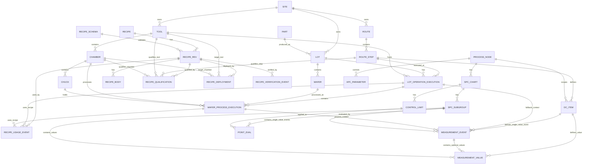

# Generic Process Domain Model with RMS / SPC / APC / FDC

## 1. Core Conclusion

This domain model is not a single-center model. It has three core anchors:

| Domain Area | Center Entity | Reason |
|---|---|---|
| Production traceability / chamber-level history | `WAFER_PROCESS_EXECUTION` | It records what actually happened to a wafer in a tool/chamber/time window |
| RMS / Recipe Management | `RECIPE_REV` | It defines the exact recipe version being created, approved, qualified, deployed, verified, and used |
| Measurement / SPC / APC analysis | `MEASUREMENT_EVENT`, optional `MEASUREMENT_VALUE`, and `PROCESS_NODE` | `MEASUREMENT_EVENT` records the collection occurrence; `MEASUREMENT_VALUE` is optional when one event contains multiple item values; `PROCESS_NODE` defines analytical/control context |

The most important connections are:

```text
RECIPE_REV
   ↓ actual recipe used by
WAFER_PROCESS_EXECUTION
   ↓ correlates with
MEASUREMENT_EVENT
   ↓ may contain / carry
MEASUREMENT_VALUE
   ↓ evaluated / controlled by
SPC / APC
```

In short:

> `Recipe Revision` defines the process recipe version.  
> `Wafer Process Execution` records the actual chamber-level production fact.  
> `Measurement Event` records a collection occurrence; it may directly carry one value or contain multiple measurement values depending on grain.  
> `Process Node` provides analytical and control scope for SPC/APC.

Important clarification:

```text
PROCESS_EXECUTION is a conceptual umbrella term.
Do not create one large "god table" called PROCESS_EXECUTION unless there is a clear platform-level reason.

Use concrete execution entities instead:
1. LOT_OPERATION_EXECUTION
2. WAFER_PROCESS_EXECUTION
```

---

## 2. Domain Scope

This document defines the generic semiconductor process domain model for RMS / SPC / APC / FDC traceability.

It covers:

```text
Lot / Wafer
Tool / Chamber / Chuck
Route Step / Operation
Recipe / Recipe Revision
Recipe qualification / deployment / verification
Lot operation execution
Wafer process execution
DC item / measurement event / optional measurement value
SPC chart / subgroup / control limit / point evaluation
APC parameter / process node
```

It does not define:

```text
gRPC metadata
APISIX routing rule
Backend service endpoint
Retry / timeout / error-code policy
Header naming convention
Request / response payload contract
```

Those belong to the separate transaction interface specification.

---

## 3. Domain Layers

```text
Master Data
  ├── SITE
  ├── PART / PRODUCT
  ├── ROUTE
  ├── ROUTE_STEP / OPERATION
  ├── TOOL
  ├── CHAMBER
  └── CHUCK optional

Material
  ├── LOT
  └── WAFER

RMS / Recipe Management
  ├── RECIPE
  ├── RECIPE_REV
  ├── RECIPE_BODY
  ├── RECIPE_SCHEMA
  ├── RECIPE_QUALIFICATION
  ├── RECIPE_DEPLOYMENT
  ├── RECIPE_VERIFICATION_EVENT
  └── RECIPE_USAGE_EVENT optional

Execution / Traceability
  ├── LOT_OPERATION_EXECUTION
  └── WAFER_PROCESS_EXECUTION

Measurement / Quality
  ├── DC_ITEM
  ├── MEASUREMENT_EVENT
  ├── MEASUREMENT_VALUE optional
  ├── SPC_CHART
  ├── SPC_SUBGROUP
  ├── CONTROL_LIMIT
  └── POINT_EVAL

Control / Analysis
  ├── PROCESS_NODE
  └── APC_PARAMETER
```

---

## 4. Key Modeling Principles

Do not directly model:

```text
LOT.chamber_id ❌
CHAMBER.lot_id ❌
LOT directly owns CHAMBER ❌
```

Correct model:

```text
LOT contains WAFER ✅
TOOL contains CHAMBER ✅
CHAMBER may contain CHUCK ✅

LOT_OPERATION_EXECUTION records lot-level operation history ✅
WAFER_PROCESS_EXECUTION records actual wafer/chamber processing ✅

RECIPE_REV records exact recipe version ✅
WAFER_PROCESS_EXECUTION records actual recipe revision used ✅

MEASUREMENT_EVENT records collection occurrence and may directly carry one value depending on grain ✅
MEASUREMENT_VALUE is optional when one event contains multiple item values ✅
PROCESS_NODE records derived analytical/control context ✅
```

Most important rule:

> Lot operation is production history.  
> Wafer process execution is chamber-level production fact.  
> Measurement event is quality/control collection fact.  
> Recipe revision is RMS master.

---

## 5. Core Entities

| Entity | Meaning | Grain |
|---|---|---|
| `SITE` | Fab / site / plant | Site |
| `PART` | Product / device / part | Product |
| `ROUTE` | Manufacturing route | Route |
| `ROUTE_STEP` | Operation / process step | Route step |
| `LOT` | Production batch / tracking unit | Lot |
| `WAFER` | Physical wafer inside a lot | Wafer |
| `TOOL` | Equipment | Tool |
| `CHAMBER` | Processing module inside tool | Chamber |
| `CHUCK` | Wafer holding position, if applicable | Chuck |
| `RECIPE` | Logical recipe family/name | Recipe |
| `RECIPE_REV` | Exact recipe version/revision | Recipe revision |
| `RECIPE_BODY` | Actual recipe content | Recipe revision |
| `RECIPE_SCHEMA` | Recipe body validation schema | Schema version |
| `RECIPE_QUALIFICATION` | Where recipe is allowed to run | Recipe rev + target scope |
| `RECIPE_DEPLOYMENT` | Where recipe has been downloaded/deployed | Recipe rev + target scope |
| `RECIPE_VERIFICATION_EVENT` | Checksum / compare / validation event | Verification event |
| `RECIPE_USAGE_EVENT` | Optional event for planned / selected / actual recipe usage | Recipe rev + execution + usage type |
| `LOT_OPERATION_EXECUTION` | Lot-level operation history | Lot + operation + tool + time |
| `WAFER_PROCESS_EXECUTION` | Wafer-level actual chamber process event | Wafer + chamber + time |
| `DC_ITEM` | Data collection item definition | Measurement definition |
| `MEASUREMENT_EVENT` | Measurement / trace / feedback collection occurrence; may directly carry one value when event grain equals value grain | Collection occurrence |
| `MEASUREMENT_VALUE` | Optional child row for an actual collected item value when one event contains multiple values | Measurement event + DC item |
| `SPC_CHART` | SPC chart definition | Chart |
| `SPC_SUBGROUP` | SPC subgroup | Chart subgroup |
| `CONTROL_LIMIT` | SPC control limit version | Limit version |
| `POINT_EVAL` | SPC point evaluation result | Evaluated point |
| `PROCESS_NODE` | Materialized process context for analysis/control | Step + equipment + product + recipe context |
| `APC_PARAMETER` | APC control parameter | Control scope |

---

## 6. Material Model

```text
LOT 1 --- N WAFER
```

Example:

```text
LOT12345
 ├── W01
 ├── W02
 ├── W03
 └── ...
```

Key rule:

> Lot is the production tracking unit.  
> Wafer is the physical processing unit.

For lot history, lot-level data may be enough.  
For chamber analysis, SPC, APC, RMS actual usage, and FDC correlation, wafer-level mapping is required.

---

## 7. Equipment Model

```text
TOOL 1 --- N CHAMBER
CHAMBER 1 --- N CHUCK
```

Example:

```text
ETCH01
 ├── CH-A
 │    ├── Chuck-1
 │    └── Chuck-2
 ├── CH-B
 └── CH-C
```

`CHUCK` is optional.  
If the process does not require chuck-level traceability, keep it nullable or omit it in implementation.

---

## 8. Execution Model

### 8.1 Conceptual Definition

The actual production fact is:

```text
A wafer
was processed at a specific route step / operation,
using a specific recipe revision,
on a specific tool / chamber / chuck,
during a specific time window.
```

That fact is `WAFER_PROCESS_EXECUTION`.

Lot-level operation history is represented separately by `LOT_OPERATION_EXECUTION`.

---

### 8.2 Two-Level Execution Model

Recommended structure:

```text
LOT_OPERATION_EXECUTION
  └── WAFER_PROCESS_EXECUTION
```

This means:

| Entity | Answers | Grain |
|---|---|---|
| `LOT_OPERATION_EXECUTION` | Did this lot run this operation on this tool? | Lot + operation + tool + time |
| `WAFER_PROCESS_EXECUTION` | Which wafer was processed by which chamber/chuck using which recipe revision? | Wafer + chamber + process time |

---

### 8.3 `LOT_OPERATION_EXECUTION`

Suggested grain:

```text
lot_id
+ route_step_id / operation_id
+ tool_id
+ operation_start_time
```

Suggested fields:

| Field | Required | Notes |
|---|---:|---|
| `lot_operation_execution_id` | Yes | Primary key |
| `lot_id` | Yes | Lot being processed |
| `route_step_id` | Yes | Process step |
| `operation_id` | Yes | MES operation |
| `tool_id` | Yes | Equipment |
| `planned_recipe_rev_id` | Optional | Expected recipe from plan / MES / RMS |
| `selected_recipe_rev_id` | Optional | Recipe selected by dispatch / RMS |
| `actual_recipe_rev_id` | Optional | Lot-level actual recipe if only lot-level data exists |
| `move_in_time` | Recommended | MES move-in time |
| `move_out_time` | Recommended | MES move-out time |
| `operation_start_time` | Recommended | Actual operation start |
| `operation_end_time` | Recommended | Actual operation end |
| `execution_status` | Yes | Success / fail / abort / rework |

Important:

```text
LOT_OPERATION_EXECUTION is not always the actual chamber process event.
It is usually closer to MES lot history or operation-level execution history.
```

---

### 8.4 `WAFER_PROCESS_EXECUTION`

Suggested grain:

```text
lot_operation_execution_id
+ wafer_id
+ chamber_id
+ process_start_time
```

Suggested fields:

| Field | Required | Notes |
|---|---:|---|
| `wafer_process_execution_id` | Yes | Primary key |
| `lot_operation_execution_id` | Recommended | Parent lot operation |
| `lot_id` | Yes | Denormalized for query |
| `wafer_id` | Yes | Actual wafer |
| `route_step_id` | Yes | Process step |
| `operation_id` | Recommended | MES operation |
| `tool_id` | Yes | Equipment |
| `chamber_id` | Strongly required | Required for chamber analysis |
| `chuck_id` | Optional | Required for chuck-level analysis |
| `actual_recipe_rev_id` | Strongly recommended | Exact recipe revision used |
| `recipe_body_hash_at_use` | Recommended | Prevent same-name-different-body issue |
| `recipe_verify_event_id` | Recommended | Link to RMS verification |
| `slot_no` | Recommended | Wafer slot |
| `process_start_time` | Yes | Wafer-level start |
| `process_end_time` | Yes | Wafer-level end |
| `execution_status` | Yes | Success / fail / abort / skip / rework |

Important:

```text
WAFER_PROCESS_EXECUTION is the central production fact for:
- chamber-level traceability
- SPC correlation
- APC control
- FDC trace alignment
- RMS actual usage
```

---

## 9. RMS Model

### 9.1 RMS Center

RMS center is:

```text
RECIPE_REV
```

RMS manages:

```text
Recipe identity
Recipe revision
Recipe body
Recipe schema validation
Recipe approval
Recipe qualification
Recipe deployment
Recipe verification
Recipe usage traceability
```

RMS should not be absorbed into execution modeling.

```text
RECIPE_REV = process definition version
WAFER_PROCESS_EXECUTION = actual production fact
```

---

### 9.2 Recipe Structure

```text
RECIPE
  └── RECIPE_REV
        ├── RECIPE_BODY
        ├── RECIPE_SCHEMA
        ├── RECIPE_QUALIFICATION
        ├── RECIPE_DEPLOYMENT
        ├── RECIPE_VERIFICATION_EVENT
        └── RECIPE_USAGE_EVENT optional
```

#### `RECIPE`

| Field | Meaning |
|---|---|
| `recipe_id` | Logical recipe ID |
| `recipe_name` | Recipe name |
| `recipe_type` | Process / clean / setup / monitor |
| `owner_system` | RMS / MES / Tool / external |
| `security_class` | Normal / Security A / Security AA |

#### `RECIPE_REV`

| Field | Meaning |
|---|---|
| `recipe_rev_id` | Exact recipe revision ID |
| `recipe_id` | Parent recipe |
| `revision` | Version / revision |
| `status` | Draft / approved / released / retired |
| `body_hash` | Hash of recipe body |
| `schema_id` | Schema used for validation |
| `approved_by` | Approver |
| `approved_time` | Approval timestamp |

#### `RECIPE_BODY`

| Field | Meaning |
|---|---|
| `recipe_body_id` | Recipe body ID |
| `recipe_rev_id` | Recipe revision |
| `body_format` | XML / formatted / unformatted / binary / vendor-specific |
| `body_content_uri` | Storage location |
| `body_hash` | Checksum |
| `encrypted_flag` | Whether body is encrypted |

#### `RECIPE_SCHEMA`

| Field | Meaning |
|---|---|
| `schema_id` | Schema ID |
| `schema_version` | Schema version |
| `schema_type` | XML Schema / YAML Schema / internal meta spec |
| `validation_rule_uri` | Rule location |
| `status` | Active / retired |

---

## 10. Recipe Lifecycle

RMS lifecycle should be explicit:

```text
Recipe Rev Created
  → Schema Validated
  → Approved
  → Qualified for Step / Tool / Chamber
  → Deployed to Tool / Chamber
  → Verified against Tool Copy
  → Used in Wafer Process Execution
```

RMS value is not just storing `recipe_id`.

Its core purpose is to ensure:

> The recipe used in production is the approved, qualified, deployed, and verified recipe revision.

---

## 11. Recipe Qualification

Recipe qualification defines where a recipe revision is allowed to run.

Recommended grain:

```text
recipe_rev_id
+ route_step_id
+ target_scope_type
+ tool_id
+ chamber_id nullable
```

Suggested fields:

| Field | Meaning |
|---|---|
| `recipe_qualification_id` | Qualification ID |
| `recipe_rev_id` | Recipe revision |
| `route_step_id` | Qualified step |
| `target_scope_type` | TOOL / CHAMBER |
| `tool_id` | Qualified tool |
| `chamber_id` | Qualified chamber; required when scope is CHAMBER |
| `qualification_status` | Qualified / not qualified / conditional |
| `effective_from` | Start time |
| `effective_to` | End time |
| `qualified_by` | Approver / system |
| `qualification_reason` | Reason / note |

Rules:

| `target_scope_type` | `tool_id` | `chamber_id` |
|---|---|---|
| `TOOL` | Required | Null |
| `CHAMBER` | Required | Required |

Important:

```text
Tool-level qualification is not always enough.
Chamber-level qualification may be required.
```

---

## 12. Recipe Deployment

Recipe deployment records whether a recipe revision has been downloaded / deployed to a tool or chamber.

Recommended grain:

```text
recipe_rev_id
+ target_scope_type
+ tool_id
+ chamber_id nullable
+ deployment_time
```

Suggested fields:

| Field | Meaning |
|---|---|
| `recipe_deployment_id` | Deployment ID |
| `recipe_rev_id` | Recipe revision |
| `target_scope_type` | TOOL / CHAMBER |
| `tool_id` | Target tool |
| `chamber_id` | Target chamber; required when scope is CHAMBER |
| `deployment_status` | Deployed / failed / removed |
| `deployment_time` | Timestamp |
| `deployed_by` | User / system |
| `tool_recipe_name` | Name on tool side |
| `tool_recipe_path` | Path on tool |
| `body_hash_on_tool` | Hash after deployment |

---

## 13. Recipe Verification

Recipe verification records compare/checksum/schema validation result.

Recommended grain:

```text
recipe_rev_id
+ tool_id
+ chamber_id nullable
+ verification_time
```

Suggested fields:

| Field | Meaning |
|---|---|
| `recipe_verify_event_id` | Verification event ID |
| `recipe_rev_id` | Recipe revision |
| `tool_id` | Tool |
| `chamber_id` | Chamber, nullable |
| `verify_type` | Checksum / compare / schema validation / permission check |
| `expected_hash` | RMS-side hash |
| `actual_hash` | Tool-side hash |
| `verify_status` | Pass / fail |
| `verify_time` | Timestamp |
| `failure_reason` | Error reason |

---

## 14. Recipe Usage

Do not over-model recipe usage by default.

### 14.1 Simplified Model

If the requirement is only:

```text
Which recipe revision was actually used?
```

Then this is enough:

```text
WAFER_PROCESS_EXECUTION.actual_recipe_rev_id
```

Fallback for lot-level only source:

```text
LOT_OPERATION_EXECUTION.actual_recipe_rev_id
```

### 14.2 Full Event Model

Use `RECIPE_USAGE_EVENT` only when the system must track:

```text
planned recipe
selected recipe
downloaded recipe
verified recipe
actual recipe
```

Suggested fields:

| Field | Meaning |
|---|---|
| `recipe_usage_event_id` | Usage event ID |
| `recipe_rev_id` | Recipe revision |
| `lot_operation_execution_id` | Lot-level execution |
| `wafer_process_execution_id` | Wafer-level execution, nullable |
| `usage_level` | Lot / Wafer |
| `usage_type` | Planned / selected / downloaded / verified / actual |
| `recipe_verify_event_id` | Verification before use |
| `body_hash_at_use` | Recipe body hash at execution |
| `used_time` | Timestamp |

Recommended rule:

```text
If chamber-level analysis is required,
link actual usage to WAFER_PROCESS_EXECUTION.
```

---

## 15. Measurement / Data Collection Model

### 15.1 Measurement Has Two Possible Grains

`DC_ITEM` is always the measurement / data collection item definition.

The actual collected data can be modeled in either of two valid ways, depending on source and API grain:

| Pattern | When to use | Model |
|---|---|---|
| Single-value event | One event/API call carries exactly one DC item value | `MEASUREMENT_EVENT` directly carries `dc_item_id + value` |
| Multi-value event | One event/API call carries multiple DC item values | `MEASUREMENT_EVENT` is the header; `MEASUREMENT_VALUE` is the child row |

Do not assume there is only one correct physical table design.

The stable domain concepts are:

```text
DC_ITEM
  = What to collect / measure
  = Measurement definition

MEASUREMENT_EVENT
  = A collection / measurement occurrence
  = When, where, and for whom the data was collected

MEASUREMENT_VALUE
  = Optional child entity
  = Actual value for one DC item when one event contains multiple item values
```

---

### 15.2 Measurement Is a Separate Fact

Measurement does not always come directly from wafer process execution.

Possible sources:

| Source | Example |
|---|---|
| In-process sensor | FDC trace / EES |
| Post-process measurement | CD / thickness / overlay |
| Inline metrology | SPC measurement |
| APC feedback | Correction / residual |
| Lot-level value | Summary / manual / aggregate |

Therefore, model measurement as a separate fact / occurrence:

```text
MEASUREMENT_EVENT
```

not merely as a child table of `WAFER_PROCESS_EXECUTION`.

---

### 15.3 `DC_ITEM`

`DC_ITEM` defines what should be collected or measured.

Suggested fields:

| Field | Required | Notes |
|---|---:|---|
| `dc_item_id` | Yes | Primary key |
| `route_step_id` | Recommended | Process step where the item applies |
| `item_name` | Yes | Name of measurement item |
| `item_type` | Recommended | Metrology / sensor / summary / feedback / manual |
| `unit` | Recommended | Default unit |
| `spec_type` | Optional | Engineering spec / control item / monitor item |
| `source_system` | Recommended | DCS / FDC / EES / Metrology / APC / Manual |
| `status` | Recommended | Active / retired |

Important:

```text
DC_ITEM is not the actual measured value.
DC_ITEM is the definition of what to collect.
```

---

### 15.4 `MEASUREMENT_EVENT` as Single-Value Event

Use this pattern when one event contains exactly one DC item value.

Suggested fields:

| Field | Required | Notes |
|---|---:|---|
| `measurement_event_id` | Yes | Primary key |
| `dc_item_id` | Yes | Measurement definition |
| `wafer_process_execution_id` | Optional | Link to wafer process if available |
| `lot_operation_execution_id` | Optional | Fallback link |
| `lot_id` | Recommended | Production context |
| `wafer_id` | Optional | Required for wafer-level metric |
| `route_step_id` | Recommended | Process context |
| `tool_id` | Optional | Equipment context |
| `chamber_id` | Optional | Chamber context |
| `recipe_rev_id` | Optional | Recipe context |
| `value` | Yes | Measured value |
| `unit` | Recommended | Unit |
| `collect_time` | Yes | Measurement time |
| `source_system` | Recommended | DCS / FDC / EES / Metrology / APC / Manual |
| `quality_flag` | Optional | Valid / invalid / suspect |

This is acceptable when the event grain and value grain are the same.

---

### 15.5 `MEASUREMENT_EVENT` + `MEASUREMENT_VALUE` as Header/Detail

Use this pattern when one collection event contains multiple DC item values.

Example:

```text
MEASUREMENT_EVENT = Lot LOT12345 / Wafer W01 / Post ETCH measurement
  ├── MEASUREMENT_VALUE: CD_WIDTH = 32.5 nm
  ├── MEASUREMENT_VALUE: THICKNESS = 500.1 Å
  ├── MEASUREMENT_VALUE: OVERLAY_X = 1.2 nm
  └── MEASUREMENT_VALUE: OVERLAY_Y = -0.8 nm
```

Suggested `MEASUREMENT_EVENT` fields:

| Field | Required | Notes |
|---|---:|---|
| `measurement_event_id` | Yes | Primary key |
| `wafer_process_execution_id` | Optional | Link to wafer process if available |
| `lot_operation_execution_id` | Optional | Fallback link |
| `lot_id` | Recommended | Production context |
| `wafer_id` | Optional | Required for wafer-level measurement |
| `route_step_id` | Recommended | Process context |
| `tool_id` | Optional | Measurement or process equipment context |
| `chamber_id` | Optional | Chamber context if known |
| `recipe_rev_id` | Optional | Recipe context if relevant |
| `collect_time` | Yes | Collection time |
| `source_system` | Recommended | DCS / FDC / EES / Metrology / APC / Manual |
| `event_type` | Recommended | Metrology / sensor / feedback / summary |

Suggested `MEASUREMENT_VALUE` fields:

| Field | Required | Notes |
|---|---:|---|
| `measurement_value_id` | Yes | Primary key |
| `measurement_event_id` | Yes | Parent collection event |
| `dc_item_id` | Yes | Measurement definition |
| `value` | Yes | Actual value |
| `unit` | Recommended | Unit |
| `quality_flag` | Optional | Valid / invalid / suspect |

Implementation note:

```text
MEASUREMENT_VALUE may also be implemented as DC_ITEM_VALUE, DC_ITEM_METRIC, or MEASUREMENT_RESULT.
The generic domain model uses MEASUREMENT_VALUE to avoid over-committing to physical table naming.
```

---

### 15.6 Linkage Rule

Preferred linkage for chamber-sensitive analysis:

```text
MEASUREMENT_EVENT.wafer_process_execution_id
```

Fallback linkage:

```text
MEASUREMENT_EVENT.lot_operation_execution_id
```

Allowed standalone context:

```text
MEASUREMENT_EVENT may carry lot_id, wafer_id, tool_id, chamber_id, route_step_id, and collect_time
when source data cannot reliably provide execution IDs.
```

Important:

```text
Lot-level measurement cannot reliably support chamber-level root cause analysis.
```

---

### 15.7 Grain Rule

Use this rule before deciding physical tables:

```text
If one measurement event contains exactly one DC item value,
MEASUREMENT_EVENT may directly carry dc_item_id and value.

If one measurement event contains multiple DC item values,
MEASUREMENT_EVENT should be modeled as header,
and MEASUREMENT_VALUE should be used as child rows.
```

---

## 16. SPC Model

Recommended SPC structure:

```text
PROCESS_NODE
  └── SPC_CHART
        ├── CONTROL_LIMIT
        ├── SPC_SUBGROUP
        └── POINT_EVAL
```

Suggested entity meaning:

| Entity | Meaning |
|---|---|
| `SPC_CHART` | Chart definition for a DC item under a process context |
| `SPC_SUBGROUP` | Group of measurement events evaluated together |
| `CONTROL_LIMIT` | Versioned control limits |
| `POINT_EVAL` | Rule evaluation result |

Recommended relationship:

```text
SPC_SUBGROUP contains N MEASUREMENT_EVENT or MEASUREMENT_VALUE rows, depending on measurement grain.
POINT_EVAL evaluates SPC_SUBGROUP with CONTROL_LIMIT
```

Key rule:

```text
If the chart is chamber-sensitive,
use WAFER_PROCESS_EXECUTION and chamber-aware PROCESS_NODE as the preferred context.
```

Reason:

```text
Lot average may hide chamber drift.
```

Example:

| Chamber | Result |
|---|---|
| CH-A | Normal |
| CH-B | Drift high |
| CH-C | Normal |

If only lot average is used, CH-B abnormality may be diluted.

---

## 17. Process Node

`PROCESS_NODE` is a materialized process context used for SPC / APC / analytics.

It is not an original production fact. It should be derived from master data and execution/measurement context.

Possible grain:

```text
site_id
+ part_id
+ route_id
+ route_step_id
+ operation_id
+ tool_id
+ chamber_id
+ recipe_id or recipe_rev_id
```

Optional dimensions:

```text
chuck_id
product_family
technology_node
lot_type
control_plan_id
```

Important design rule:

```text
recipe_rev_id should be included in PROCESS_NODE only when recipe version materially changes SPC/APC behavior.
Otherwise, keep recipe revision as an analysis dimension rather than part of the core process node key.
```

Decision guide:

| Situation | Include `recipe_rev_id` in `PROCESS_NODE` key? |
|---|---|
| Recipe minor revision does not affect SPC/APC behavior | No; keep as dimension |
| Recipe revision changes process behavior | Yes |
| Control limit is recipe-revision-specific | Yes |
| Recipe is only needed for traceability | No |

Purpose:

```text
PROCESS_NODE → DC_ITEM → MEASUREMENT_EVENT / MEASUREMENT_VALUE → SPC_SUBGROUP → POINT_EVAL
PROCESS_NODE → APC_PARAMETER
```

---

## 18. APC Model

APC parameters may need to be scoped by:

```text
part_id
+ route_step_id
+ tool_id
+ chamber_id
+ recipe_id / recipe_rev_id
```

Do not assume:

```text
Same Tool = Same Chamber Behavior ❌
```

Better assumption:

```text
Each Chamber may have its own fingerprint, offset, drift, and control parameter ✅
```

Possible `APC_PARAMETER` fields:

| Field | Meaning |
|---|---|
| `apc_parameter_id` | Parameter ID |
| `process_node_id` | Control scope |
| `parameter_name` | Parameter |
| `parameter_value` | Value |
| `effective_from` | Start time |
| `effective_to` | End time |
| `source` | Manual / model / rule / feedback |
| `status` | Active / retired |

---

## 19. Example Scenario

A lot has 25 wafers. Same lot, same operation, same tool, but different wafers may use different chambers.

| Lot | Wafer | Operation | Tool | Chamber | Recipe Rev |
|---|---|---|---|---|---|
| LOT12345 | W01 | ETCH-100 | ETCH01 | CH-A | RCP_ETCH_V3 |
| LOT12345 | W02 | ETCH-100 | ETCH01 | CH-B | RCP_ETCH_V3 |
| LOT12345 | W03 | ETCH-100 | ETCH01 | CH-A | RCP_ETCH_V3 |
| LOT12345 | W04 | ETCH-100 | ETCH01 | CH-C | RCP_ETCH_V3 |

Bad statement:

```text
LOT12345 used ETCH01.
```

Better statement:

```text
W01 used RCP_ETCH_V3 on ETCH01 / CH-A.
W02 used RCP_ETCH_V3 on ETCH01 / CH-B.
W03 used RCP_ETCH_V3 on ETCH01 / CH-A.
W04 used RCP_ETCH_V3 on ETCH01 / CH-C.
```

---

## 20. Integrated ER Model



---

## 21. Final Conceptual Model

```text
SITE
 ├── TOOL
 │    └── CHAMBER
 │         └── CHUCK optional
 └── ROUTE
      └── ROUTE_STEP

PART
 └── LOT
      └── WAFER

RECIPE
 └── RECIPE_REV
      ├── RECIPE_BODY
      ├── RECIPE_SCHEMA
      ├── RECIPE_QUALIFICATION
      ├── RECIPE_DEPLOYMENT
      └── RECIPE_VERIFICATION_EVENT

LOT
 └── LOT_OPERATION_EXECUTION
      ├── ROUTE_STEP
      ├── TOOL
      ├── planned / selected / actual RECIPE_REV optional
      └── WAFER_PROCESS_EXECUTION
            ├── WAFER
            ├── CHAMBER
            ├── CHUCK optional
            ├── actual RECIPE_REV
            └── process time window

MEASUREMENT / QUALITY
 ├── DC_ITEM
 ├── MEASUREMENT_EVENT
 │    └── optional MEASUREMENT_VALUE
 └── SPC_SUBGROUP
      └── POINT_EVAL

WAFER_PROCESS_EXECUTION
 └── may correlate with MEASUREMENT_EVENT

PROCESS_NODE
 ├── DC_ITEM
 ├── SPC_CHART
 └── APC_PARAMETER
```

---

## 22. Modeling Rules

### Rule 1: Do not create a process execution god table

Bad:

```text
PROCESS_EXECUTION contains all lot, wafer, chamber, recipe, measurement, SPC, APC fields
```

Correct:

```text
LOT_OPERATION_EXECUTION
WAFER_PROCESS_EXECUTION
MEASUREMENT_EVENT
RECIPE_REV
PROCESS_NODE
```

---

### Rule 2: Use `WAFER_PROCESS_EXECUTION` for chamber-level traceability

Bad:

```text
LOT.chamber_id
```

Correct:

```text
WAFER_PROCESS_EXECUTION.chamber_id
```

---

### Rule 3: RMS center is `RECIPE_REV`

```text
RECIPE
  └── RECIPE_REV
```

`RECIPE_REV` is the exact version used for validation, approval, qualification, deployment, verification, and production traceability.

---

### Rule 4: Recipe usage event is optional

Use:

```text
WAFER_PROCESS_EXECUTION.actual_recipe_rev_id
```

for simple actual usage.

Use:

```text
RECIPE_USAGE_EVENT
```

only when planned / selected / downloaded / verified / actual recipe states must be tracked separately.

---

### Rule 5: Measurement grain must be explicit

Correct:

```text
DC_ITEM defines what to collect.
MEASUREMENT_EVENT records the collection occurrence.
MEASUREMENT_VALUE is optional and only required when one event contains multiple item values.

MEASUREMENT_EVENT may link to WAFER_PROCESS_EXECUTION.
MEASUREMENT_EVENT may link to LOT_OPERATION_EXECUTION.
MEASUREMENT_EVENT may carry standalone context when source data is incomplete.
```

Do not force a header/detail design when the source grain is already one event per item value.

---

### Rule 6: `PROCESS_NODE` is derived analytical/control context

Do not treat `PROCESS_NODE` as the original fact.

It should be derived from:

```text
master data
+ execution context
+ measurement context
+ recipe context
```

---

## 23. Final Summary

The integrated domain model should be understood as:

```text
Recipe Revision = RMS process definition version
Lot Operation Execution = lot-level production history
Wafer Process Execution = chamber-level production fact
Measurement Event = quality/control collection occurrence
Measurement Value = optional actual item value when one event contains multiple values
Process Node = derived analytical/control context
```

Most important conclusion:

> `WAFER_PROCESS_EXECUTION` is the central production fact for chamber-level traceability, SPC, APC, FDC, and RMS actual usage.  
> `RECIPE_REV` is the central RMS master entity.  
> `MEASUREMENT_EVENT` is the central quality/control collection fact.  
> `PROCESS_NODE` is the derived context for SPC/APC control and analysis.
